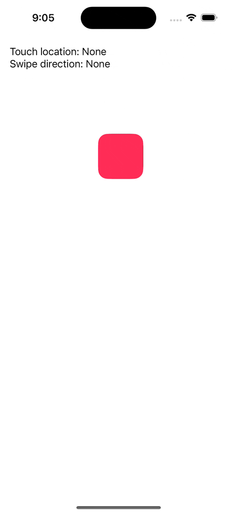

## Gestures: Enhanced gesture API for SwiftUI




Gestures is a lightweight, open-source extension to the SwiftUI gesture API that removes a limitation before iOS 16 and macOS 13 - the inability to locate gestures.

## How to Use
This code block demonstrates how to use the Gestures library with SwiftUI:
```swift
Rectangle()
  .onTouchGesture(count: 1) { gesture in
    print(gesture.location)
  }
  .onSwipeGesture(minimumDistance: 15.0, coordinateSpace: .local) { direction, location in
    print(direction, location)
  } onEnded: { direction, location in
    print(direction, location)
  }
```
For additional usage examples, please refer to the [example application](Example/).

## Getting Started: Installation
### Swift Package Manager
To install the Gestures library with Swift Package Manager, add the following line to the dependencies array in your **Package.swift** file::
```swift
.package(url: "https://github.com/vospennikov/Gestures.git", .upToNextMinor(from: "1.0.6"))
```
### Cocoapods
Alternatively, you can install Gestures using CocoaPods. Add the following line to your Podfile:
```ruby
pod 'SUIGestures', '1.0.6'
```
## Documentation

The documentation for releases and `main` are available here:

* [`1.0.6`](https://vospennikov.github.io/Gestures/1.0.6/documentation/gestures/)
* [`1.0.5`](https://vospennikov.github.io/Gestures/1.0.5/documentation/gestures/)
* [`main`](https://vospennikov.github.io/Gestures/main/documentation/gestures)

## License
The Gestures library is available under the MIT license. See the LICENSE file for more info.
